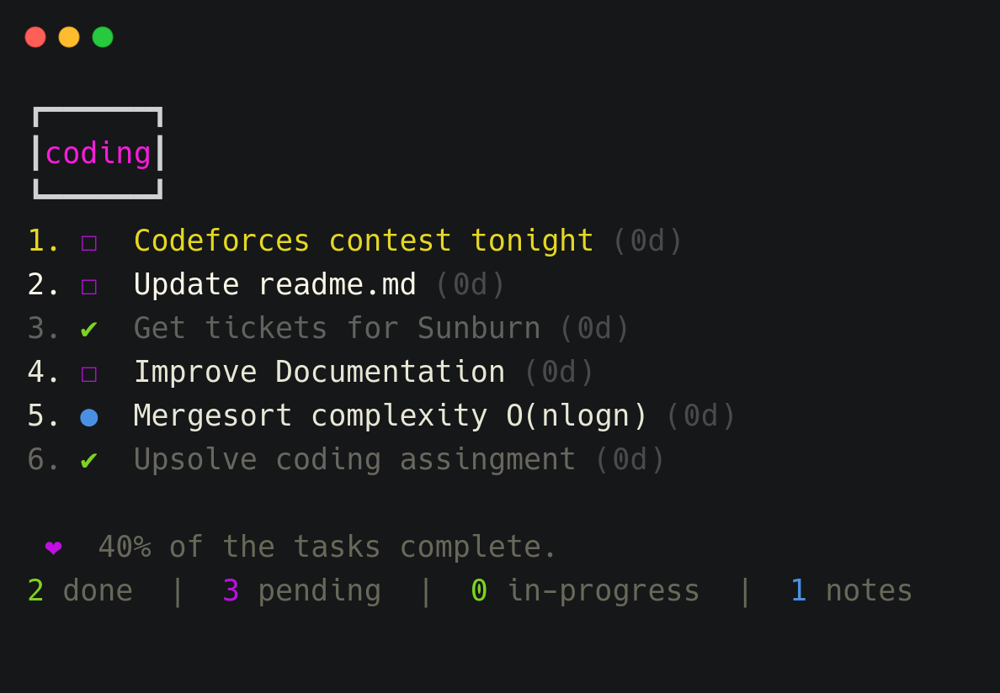
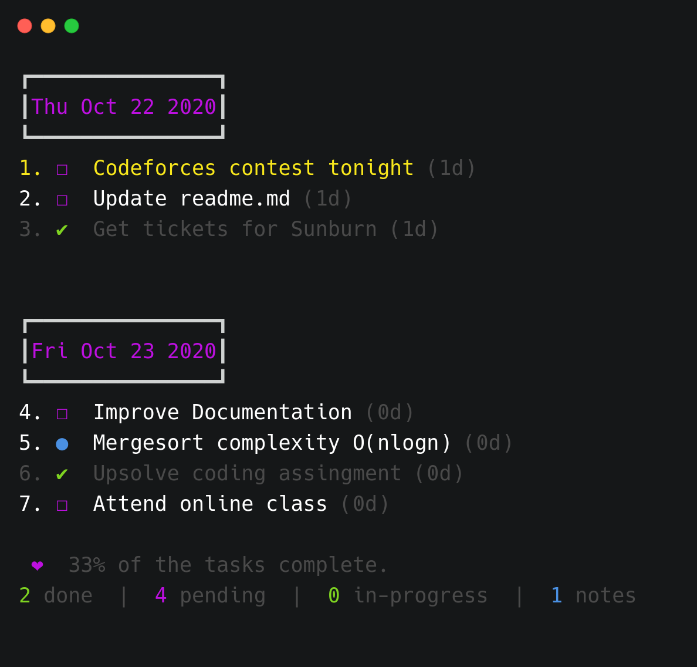

<h1 align="center">
  TaskListner
</h1>

<h4 align="center">
  Tasks, boards & notes for the command-line habitat
</h4>

<div align="center">
  
</div>

## Description

By utilizing a simple and minimal usage syntax, that requires a flat learning curve, tasklistner enables you to effectively manage your tasks and notes across multiple boards from within your terminal. All data are written atomically to the storage in order to prevent corruptions, and are never shared with anyone or anything.

## Highlights

- Organize tasks & notes to boards
- Board & timeline views
- Priority & favorite mechanisms
- Search & filter items
- Archive & restore deleted items
- Lightweight & fast
- Data written atomically to storage
- Progress overview
- Simple & minimal usage syntax
- Update notifications
- Data stored in JSON file at `~/.taskListner.json`

## Usage

```
$ tl --help

  Usage
    $ tl [<options> ...]
    Options
        none             Display board view
      --help,     -h     Help log message
      --version,  -v     Current version
      --task,     -t     Create task
      --note,     -n     Create note
      --remove    -r     Remove items
      --done,     -d     Mark task done/pending
      --priority, -p     Update priority of task
      --board     -b     Change board name
      --edit,     -e     Edit item description
      --move,     -m     Move item between boards
      --find,     -f     Find item/boards
      --star,     -s     Star/unstar item
      --copy,     -c     Copy item description to clipboard
      --unpin,    -u     Remove all completed tasks
      --timeline, -i     Display timeline view
      --begin,    -b     Begin/Pause task
      --list,     -l     List items by attributes
      --erase,    -e     Clear all the items

    Examples
      $ tl
      $ tl --help
      $ tl --version
      $ tl --task Check commit b:project p:2
      $ tl --note Complexity of Merge-sort is O(nlogn) b:project
      $ tl --remove 1
      $ tl --done 2
      $ tl --priority 2 p:3
      $ tl --board c:project n:coding
      $ tl --edit 2 Some new task description
      $ tl --move 1 b:college
      $ tl --find college
      $ tl --star 3
      $ tl --copy 1 2 3
      $ tl --unpin
      $ tl --timeline
      $ tl --begin 2
      $ tl --list pending
      $ tl --erase
```

## Views

### Board View

Invoking tasklistner without any options will display all saved items grouped into their respective boards.

<div align="center">
  
</div>

### Timeline View

In order to display all items in a timeline view, based on their creation date, the `--timeline` option can be used.

<div align="center">
  
</div>

## Flight Manual

The following is a minor walkthrough containing a set of examples on how to use tasklistner.

### Create Task

To create a new task use the `--task`/`-t` option with your task's description following right after. There are two optional arguements `b:<board-name>` and `p:<priority>`. By default board name is `Default` and priority is 3.

```
$ tl -t Improve documentation
$ tl -t Improve documentation b:coding p:2

```

### Create Note

To create a new note use the `--note`/`-n` option with your note's body following right after. There are two optional arguements `b:<board-name>` and `p:<priority>`. By default board name is `Default` and priority is 3.

```
$ tl -n Mergesort worse-case O(nlogn)
$ tl -n Mergesort worse-case O(nlogn) b:college p:2
```

### Remove Item

To delete an item, use the `--remove`/`-r` options followed by the id of the target items. Duplicate ids are automatically filtered out.

```
$ tl -r 2
```

### Done Task

To mark a task as complete/incomplete, use the `--done`/`-d` option followed by the id of the target task. Note that the option will update to its opposite the `complete` status of the given tasks, thus checking a complete task will render it as pending and a pending task as complete. Duplicate ids are automatically filtered out.

```
$ tl -d 1
```

### Set Priority

To set a priority level for a task while initializing it, include id and the `p:x` syntax in the task's description, where x can be an integer of value `1`, `2` or `3`. Note that all tasks by default are created with a normal priority - `3`.

- `3` - Normal priority
- `2` - Medium priority
- `1` - High priority

```
$ tl -p 1 p:3
```

### Change Boards

To change the name of the board, use the `--board/-b` option follwed by `c:x`, where x is the board name to be changed and then `n:y`, where y is the new name of the board.

```
$ tl -b c:coding n:college
```

### Edit Item

To change the description of an item, use the `--edit/-e` option follwed by the id of the target task and new description to be assigned.

```
$ tl -e 2 New task description
```

### Move Item

To move an item to another boards, use the `--move`/`-m` option, followed by the target item id, prefixed by the `b:` symbol, and the name of the destination board. The default board `Default` can be accessed through the `default` keyword.

```
$ tl -m 1 myboard reviews
```

### Star Item

To mark an item as favorite, use the `--star`/`-s` option followed by the id of the target item. The functionality of this option is the same as the one of the above described `--done` option.

```
$ tl -s 1
```

### Copy Item Description

To copy to your system's clipboard the description of one or more items, use the `--copy`/`-y` option followed by the ids of the target items. Note that the option will also include the newline character as a separator to each pair of adjacent copied descriptions, thus resulting in a clear and readable stack of sentences on paste.

```
$ tl -c 1 2 3
```

### Delete Marked Done Tasks

To delete/clear all complete tasks at once across all boards, use the `--unpin`/`-u` option.

```
$ tl --unpin
```

### Display Timeline

In order to display all items in a timeline view, based on their creation date, the `--timeline` option can be used.

```
$ tl --timeline
```

### Begin Task

To mark a task as started/paused, use the `--begin`/`-b` option followed by the id of the target task. The functionality of this option is the same as the one of the above described `--check` option.

```
$ tl -b 2
```

### List Items

To list a group of items where each item complies with a specific set of attributes, use the `--list`/`-l` option followed by the desired attributes. Board names along with item traits can be considered valid listing attributes. For example to list all pending tasks, the following could be used. The available attributes are `pending/in-process/done/notes`.

```
$ tl -l pending
```

### Find Items

To find for task/board, use the `--find`/`-f` option, followed by id of the task or name of the board.

```
$ tl -l coding
```

### Erase Items

To remove all the elements and boards use `--erase`.

```
$ tl --erase
```

## Related

- [signale](https://github.com/klaussinani/signale) - Highly configurable logging utility
- [chalk](https://www.npmjs.com/package/chalk) - Terminal string styling done right
- [clipboardy](https://www.npmjs.com/package/clipboardy) - Access the system clipboard (copy/paste)
- [boxen](https://www.npmjs.com/package/boxen) - Create boxes in the terminal
- [meow](https://www.npmjs.com/package/meow) - CLI app helper
- [carbon](https://carbon.now.sh/) - Create and share beautiful images of your source code.


## Creator

- Mansimar Anand [(@anandman03)](https://github.com/anandman03)

## License

[MIT](LICENSE)